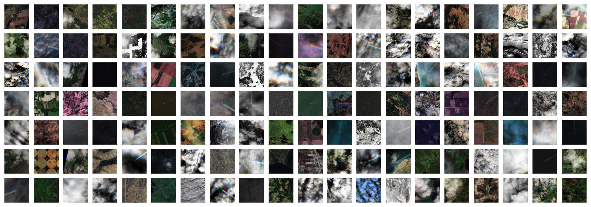

# Observing formation and early evolution of contrails formed by IAGOS aircraft using high-resolution LEO satellite imagery

## Overview

This repository contains the code and data necessary to reproduce the figures from our paper:

**DOI:** *(to be added)*

The study focuses on observing the formation and early evolution of contrails produced by IAGOS aircraft using high-resolution LEO satellite imagery, including Sentinel-2 and Landsat.

## Data

The raw data, including satellite images, annotations, IAGOS measurements, and ERA5 data, can be found at *(add link to zenodo data)*.  

For reproducing the final results without the need for raw satellite data or alterations, you can use the local CSV file: *(add file)*

## Code

- **Figure reproduction:**  
  Code to reproduce the figures from the paper is located in: [notebooks/paper_reproduction](notebooks/paper_reproduction)

## Adding New Satellite Collocations

To add new collocations between aircraft and satellite data, you can:  

1. Use the `pycontrails` function for collocating flights with Sentinel-2 and Landsat imagery.  
2. Contact *(Thymen Woldhuis)* for access to the source code for additional processing if needed.

## License

This project is licensed under the Apache License. See the [LICENSE](LICENSE) file for details.
